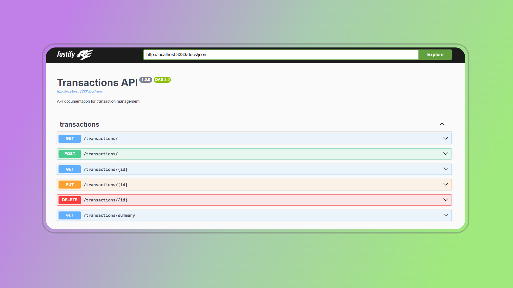

# Transactions API

<p align="center">
  <strong>
    CRUD to register and manage transactions
  </strong>
</p>

<p>&nbsp;</p>

<p align="center">
  
</p>

<p>&nbsp;</p>

<p align="center">
  

  

  
</p>

<p align="center">
  <a href="#computer-features">Features</a>&nbsp;&nbsp;&nbsp;|&nbsp;&nbsp;&nbsp;
  <a href="#gear-settings">Settings</a>&nbsp;&nbsp;&nbsp;|&nbsp;&nbsp;&nbsp;
  <a href="#arrow_down_small-cloning-the-repository">Cloning the repository</a>&nbsp;&nbsp;&nbsp;|&nbsp;&nbsp;&nbsp;
  <a href="#beginner-starting-the-application">Starting the application</a>&nbsp;&nbsp;&nbsp;|&nbsp;&nbsp;&nbsp;
  <a href="#test_tube-running-the-tests">Running the tests</a>&nbsp;&nbsp;&nbsp;|&nbsp;&nbsp;&nbsp;
  <a href="#wrench-techs--tools--resources">Techs | Tools | Resources</a>&nbsp;&nbsp;&nbsp;|&nbsp;&nbsp;&nbsp;
  <a href="#memo-license">License</a>
</p>

### :pushpin: Context

**Transactions API** is an application developed by using the [Fastify](https://fastify.dev/) Node framework and it was created to put in practice what I've been studying about backend implementation.

**Major assumptions or design choices**

1) I've used TypeScript because you can save time by avoiding bugs due to typos and other errors, it offers faster performance and the IntelliSense works better, generating a superior developer experience

### :computer: Features

**Done**

- [x] Create a transaction;
- [x] List all transactions;
- [x] List a specific transaction by id;
- [x] Update a transaction;
- [x] Delete a specific transaction;
- [x] Get the summary of the transactions;
- [x] Transactions can only be managed by the owner (through session recognition)

### :gear: Settings

The settings to execute the application on your computer are listed below.

- [Git](https://git-scm.com);
- [Node](https://nodejs.org/);
- [Npm](https://www.npmjs.com/).

### :arrow_down_small: Cloning the repository

1. Through the terminal, go to the directory where you want to have the repository cloned and run the following command:

```bash
# cloning the repository
git clone https://github.com/belapferreira/transactions-api.git
```

### :beginner: Starting the application

1. Open the code of the repo cloned, duplicate the `.env.example` file and rename to `.env`. 

2. Duplicate the `.env.test.example` as well, renaming it to `.env.test`.

3. Through the terminal, go to the directory where the repository was cloned and run the following commands:

```bash
# installing dependencies
npm install

# running the migrations
npm run knex -- migrate:latest

# starting application
npm run dev
```

### :test_tube: Running the tests

1. Through the terminal in the directory of the project repository run the following command:

```bash
# running tests
npm test
```

> [!NOTE]
> Docs: http://localhost:${PORT}/docs
> `http://localhost:3333/docs` 

### :wrench: Techs | Tools | Resources

This project was developed using the following resources:

-  [Eslint](https://eslint.org/)
-  [Fastify](https://fastify.dev/)
-  [Knex](https://knexjs.org/)
-  [Sqlite3](https://www.npmjs.com/package/sqlite3)
-  [Supertest](https://www.npmjs.com/package/supertest)
-  [Tsup](https://tsup.egoist.dev/)
-  [Tsx](https://www.npmjs.com/package/tsx)
-  [TypeScript](https://www.typescriptlang.org/)
-  [Vitest](https://vitest.dev/)
-  [Zod](https://zod.dev/)


### :memo: License

This project is under MIT license. See [LICENSE](https://github.com/belapferreira/transactions-api/blob/master/LICENSE) for more information.

---

Developed by Bela Ferreira :blue_heart: Contact: https://www.linkedin.com/in/belapferreira :blush:

